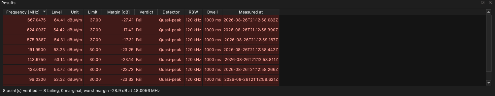
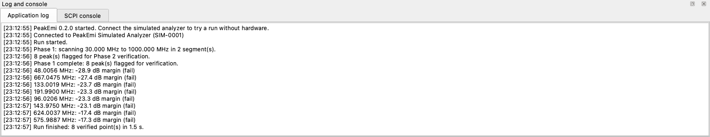

# PeakEmi

[](https://github.com/bitcrushtesting/peakemi/actions/workflows/ci.yml)
[](https://github.com/bitcrushtesting/peakemi/actions/workflows/release.yml)
[](https://github.com/bitcrushtesting/peakemi/releases)
[](LICENSE)
[](docs/architecture.md#23-permitted-c23-subset)
[](https://www.qt.io/)
[](#building)

Cross-platform, open-source **EMI pre-compliance measurement suite**. PeakEmi drives spectrum
analyzers over TCP/VXI-11, USBTMC or serial, automates the two-phase scan → detect → verify loop,
evaluates traces against CISPR/FCC limit lines and produces reproducible reports.

> **Pre-compliance only.** Results are indicative engineering data, not an accredited compliance
> measurement.

| | |
|---|---|
| Status | Early development: the measurement suite, its instrument buses, reporting and the plugin bridge are in place (milestones M0–M7) |
| Language | C++23, Qt 6.8+ (developed on 6.10) |
| Platforms | Windows 10/11, Linux (Ubuntu 22.04+), macOS 13+ |
| Docs | [Contributing](CONTRIBUTING.md) · [Requirements](docs/requirements.md) · [Architecture](docs/architecture.md) · [Plugin API](docs/plugin-api.md) · [Tasklist](tasklist.md) |

## Why PeakEmi

* **Runs where you work.** One source tree, one feature set, on Windows, Linux and macOS.
* **Not tied to one instrument vendor.** The buses are the standard ones and the driver is
  chosen by scoring the instrument's `*IDN?` reply. A model nobody has written a driver for
  can be added as a single Python file rather than as a patch to the application. Supported
  models declare their own frequency range, point count and command dialect, so a sweep the
  instrument cannot make is refused with a reason rather than sent and rejected.
* **Nothing is hidden.** Every SCPI exchange is visible in the console and in the
  `--verbose` transcript. Limit lines and correction tables are documented CSV/JSON you can
  write by hand, and sessions are versioned JSON, so your measurements stay diffable,
  scriptable and readable without PeakEmi.
* **Nothing to plug in to start.** The simulated analyzer ships with the application, so the
  full loop, including the report, can be tried before any hardware is on the bench.
* **Results keep their provenance.** Every verified point carries the settings that produced
  it, and the session file is the record of the run rather than a screenshot of it.
* **No licence server, no dongle, no seat count.** GPL-3.0-or-later; build it yourself and
  run it offline.

The instrument list is short and the scope is deliberately narrow: pre-compliance
measurement, not lab automation. Turntables, masts and LISNs are switched through the
[commands sent around a run](#what-works-today), not driven by PeakEmi.

## Screenshots

A completed run against the built-in simulated analyzer: a CISPR 32 class B radiated scan with
an antenna factor and cable loss applied, eight peaks verified with the quasi-peak detector.


The spectrum view carries the live trace, the active limit line, the flagged peaks and the
verified Phase 2 points. Traces are decimated to a min/max envelope per pixel column, so a
40,001-point trace pans and zooms without dropping frames.


Every verified point lands in the results table with its full provenance (detector, resolution
bandwidth, dwell time, limit, margin and timestamp), coloured by verdict.


The interface follows the desktop colour scheme, and the verdict colours are chosen per scheme
so the table stays readable in either:



The log dock keeps the run narrative and the raw SCPI transcript side by side, so what the
application asked the instrument is always inspectable.



The screenshots are generated by driving the real main window against the simulated analyzer,
so they cannot drift from the application:

```bash
cmake --preset debug -DPEAKEMI_BUILD_TOOLS=ON
cmake --build --preset debug --target peakemi_screenshots
QT_QPA_PLATFORM=offscreen ./build/debug/bin/peakemi_screenshots docs/images
QT_QPA_PLATFORM=offscreen ./build/debug/bin/peakemi_screenshots docs/images --dark
```

## What works today

* **Two-phase automated run**: fast peak scan, peak flagging against the active limit
  lines, then a quasi-peak dwell on every flagged peak with the CISPR-mandated RBW.
  Pausable, resumable, abortable, with autosave after every verified point.
* **Simulated analyzer**: ships with the app, needs no hardware, and produces a
  deterministic spectrum that fails CISPR 32 class B in a few places, so a new user can
  go from launch to a finished run and a PDF report in a minute.
* **Instruments**: raw SCPI over TCP, VXI-11, USBTMC and serial, `*IDN?`-scored driver
  selection, bounded and opt-in LAN sweep, live USB hotplug detection, serial port
  enumeration, an optional VISA path, and a raw SCPI console.
* **Supported analyzers**: Siglent SSA3021X/3032X/3075X and SVA1015X/1032X/1075X, Rigol
  DSA705/710 and DSA815/832/875, each with its own frequency range, point count and
  command dialect.
* **Python driver plugins**: in a build configured with `PEAKEMI_WITH_PYTHON=ON`, a
  driver can be a single Python file loaded into the embedded interpreter, and the
  measurement engine cannot tell it from one written in C++. A plugin is
  imported only after you approve it, and the approval is recorded as a hash of the file's
  contents, so an edited plugin is untrusted again until you say otherwise. See the
  [plugin API](docs/plugin-api.md) and the worked
  [example driver](plugins/drivers/example_sweeper.py).
* **Commands around a run**: a run can send operator-supplied commands when it starts and
  when it ends, which is how a LISN, a relay box or a mast that speaks SCPI is switched.
  The closing commands are sent whether the run finished, was aborted or failed. PeakEmi
  drives no relays itself.
* **Limits and corrections**: built-in CISPR 32 / EN 55032 and FCC Part 15 B catalogue,
  CSV/JSON import of custom limits and of antenna/cable/gain correction tables
  (see [`resources/`](resources) for the documented file formats).
* **Headless runs for CI**: `peakemi-cli` performs the same measurement from a build
  script, with no display and no window system, and reports the verdict as its exit code —
  0 within the limits, 1 outside them. It writes the session, the CSV and JSON result
  tables and the PDF report, and a `--summary json` block for whatever reads the job's
  output. A run can be configured entirely on the command line or taken from a session
  saved in the application.
* **Sessions and exports**: versioned JSON session container written atomically, CSV and
  JSON export of traces and results, and a PDF report carrying the mandatory
  pre-compliance disclaimer. Company, address, logo and the free-text sections come from
  a report template that can be edited in the app, shared as a file and kept as the
  default.

What is left is packaging: a notarised macOS disk image, signed Windows artifacts and a
Windows installer, see [tasklist.md](tasklist.md).

### Instrument buses

| Bus | Build option | Notes |
|---|---|---|
| Raw SCPI over TCP | always | Ports 5025/5555, the default for LAN instruments |
| VXI-11 | always | Finds its own port through the portmapper; use for instruments with no raw socket |
| Serial | always | Configurable baud rate, framing and terminator |
| USBTMC | `PEAKEMI_WITH_USBTMC=ON` | Needs libusb 1.0; instruments appear and disappear live |
| VISA | `PEAKEMI_WITH_VISA=ON` | Resolved at run time; absent runtime simply removes the option |

## Building

Requirements: CMake ≥ 3.24, Ninja, a C++23 compiler (MSVC 2022 / GCC 13+ / Clang 17+) and Qt 6.8+
with the `Widgets`, `Network`, `SerialPort`, `PrintSupport`, `Svg` and `Test` modules.

```bash
# Point CMake at your Qt installation if it is not in the default search path
export CMAKE_PREFIX_PATH="$HOME/Qt/6.10.2/macos"     # or C:/Qt/6.10.2/msvc2022_64, /usr/lib/qt6, ...

cmake --preset debug          # configure
cmake --build --preset debug  # build
ctest --preset debug          # run the tests
```

Available configure presets: `debug`, `release`, `relwithdebinfo`, `dev` (sanitizers + clang-tidy
+ warnings-as-errors) and `ci`. The whole CI flow is `cmake --workflow --preset ci`.

Both binaries land in `build/<preset>/bin/`: `peakemi`, the application, and `peakemi-cli`,
the headless runner.

### Build options

| Option | Default | Effect |
|---|---|---|
| `PEAKEMI_BUILD_TESTS` | `ON` | Build the Qt Test suite |
| `PEAKEMI_BUILD_TOOLS` | `OFF` | Build the developer tools (README screenshot generator) |
| `PEAKEMI_WITH_PYTHON` | `OFF` | Embed CPython for Python driver plugins (pulls pybind11) |
| `PEAKEMI_WITH_USBTMC` | `OFF` | Build the USBTMC transport and USB hotplug discovery (needs libusb-1.0) |
| `PEAKEMI_WITH_VISA` | `OFF` | Enable the optional VISA transport |
| `PEAKEMI_WARNINGS_AS_ERRORS` | `OFF` | Promote compiler warnings to errors (CI turns this on) |
| `PEAKEMI_ENABLE_CLANG_TIDY` | `OFF` | Run clang-tidy during the build |
| `PEAKEMI_ENABLE_SANITIZERS` | `OFF` | ASan + UBSan |
| `PEAKEMI_ENABLE_COVERAGE` | `OFF` | Coverage instrumentation (GCC/Clang) |

## Running

```bash
./build/debug/bin/peakemi              # or open build/debug/bin/peakemi.app on macOS
./build/debug/bin/peakemi session.json # open a saved session
./build/debug/bin/peakemi --verbose    # log the full SCPI transcript
```

Connect **Simulated → Simulated Analyzer** in the instrument dock, tick a limit line in
the run configuration dock and press **Start run** (F5) to see the complete loop without
any hardware attached. Logs are written to the platform application data directory.

## Headless runs and CI

`peakemi-cli` is the same measurement suite without the window. It needs no display — it
asks Qt for the offscreen platform plugin unless you have chosen one — so it runs on a
build agent, in a container or over SSH.

```bash
peakemi-cli \
  --limit "CISPR 32 Class B radiated 10 m (QP)" \
  --correction resources/corrections/example-antenna-factor.csv \
  --start 30M --stop 1G --points 4001 --dwell 1s \
  --eut "Widget rev C" --operator "$USER" \
  --output-dir artefacts
```

That run uses the simulated analyzer, so it works on a machine with nothing attached. Point
it at real hardware with `--instrument`:

| Endpoint | Meaning |
|---|---|
| `sim` | The built-in simulated analyzer (the default) |
| `tcp:192.168.1.20` · `tcp:192.168.1.20:5555` | Raw SCPI over TCP, port 5025 unless given |
| `vxi11:10.0.0.5` | VXI-11, port found through the portmapper |
| `serial:/dev/ttyUSB0:115200` | Serial, baud rate optional |
| `usbtmc:RESOURCE` · `visa:RESOURCE` | USBTMC and VISA resource strings, taken verbatim |

The driver is chosen by scoring the instrument's `*IDN?` reply, or named outright with
`--driver`; `--list-drivers` and `--list-limits` print what this build has. `--help` lists
every option.

### Exit codes

The exit code is the point of the whole thing, so it distinguishes a result from a broken
job — an emission over the limit is not the same event as an instrument that stopped
answering, and a pipeline treats them differently.

| Code | Meaning |
|---|---|
| `0` | The run finished and the verdict is within what `--fail-on` allows |
| `1` | The run finished and the verdict is worse than that |
| `2` | The command line, a limit file or the requested span was wrong; nothing was measured |
| `3` | The run could not be completed: the instrument, the transport or an output file failed |
| `4` | The run was cancelled (SIGINT/SIGTERM); the stop commands still went out |

`--fail-on marginal` also fails the job for points inside the marginal band, and
`--fail-on never` reduces the exit code to "did the run complete".

### Artefacts

`--output-dir` writes five files under fixed names — `session.peakemi.json`, `results.csv`,
`results.json`, `trace.csv` and `report.pdf` — so a job can archive the directory without
knowing the generated run id. Name them individually with `--out-session`,
`--out-results-csv`, `--out-results-json`, `--out-trace-csv` and `--out-report-pdf`. The
session is autosaved after every verified point, so a job killed mid-run still leaves the
points it had already verified.

### In a pipeline

```yaml
- name: EMI pre-compliance scan
  run: |
    peakemi-cli --quiet --summary json \
      --instrument tcp:192.168.1.20 \
      --limit "CISPR 32 Class B radiated 10 m (QP)" \
      --correction antenna-factor.csv \
      --start 30M --stop 1G --dwell 1s \
      --eut "$GITHUB_REPOSITORY" --run-id "$GITHUB_RUN_ID" \
      --output-dir emi-artefacts | tee emi-summary.json

- uses: actions/upload-artifact@v4
  if: always()
  with:
    name: emi-artefacts
    path: emi-artefacts/
```

A configuration worked out interactively can be reused instead of restated: save the
session in the application and pass it as `--session run.peakemi.json`. Any option given
alongside it amends what the file says, and options left out leave it alone.

Where to find `peakemi-cli` in a release: beside the application in the Windows archive,
inside `PeakEmi.app/Contents/MacOS/` in the macOS disk image, and at `usr/bin/peakemi-cli`
inside the Linux AppImage (`./PeakEmi.AppImage --appimage-extract`). Building from source
installs both binaries into `bin/`.

## Licence

GPL-3.0-or-later, the full text is in [LICENSE](LICENSE). The plugin API headers are
dual-licensed so that proprietary in-house drivers remain possible; see
[requirements.md §1.4](docs/requirements.md#14-technology-stack-con-3).
