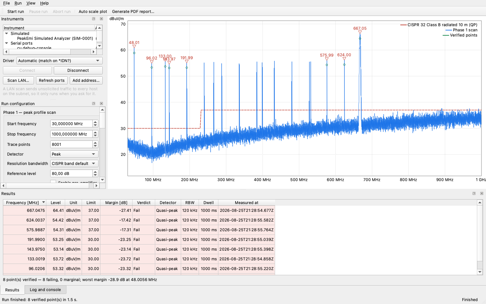
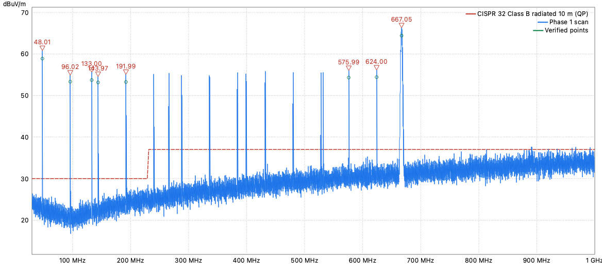
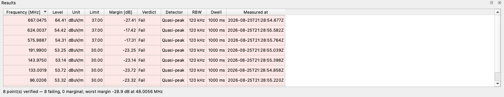

# PeakEmi

[](https://github.com/bitcrushtesting/peakemi/actions/workflows/ci.yml)
[](https://github.com/bitcrushtesting/peakemi/actions/workflows/release.yml)
[](https://github.com/bitcrushtesting/peakemi/releases)
[](LICENSE)
[](docs/architecture.md#23-permitted-c23-subset)
[](https://www.qt.io/)
[](#building)

Cross-platform, open-source **EMI pre-compliance measurement suite**. PeakEmi drives spectrum
analyzers over TCP/VXI-11, USBTMC or serial, automates the two-phase scan → detect → verify loop,
evaluates traces against CISPR/FCC limit lines and produces reproducible reports.

> **Pre-compliance only.** Results are indicative engineering data, not an accredited compliance
> measurement.

| | |
|---|---|
| Status | Early development — core, HAL, engine, UI and reporting in place (milestones M0–M4, M6 partial) |
| Language | C++23, Qt 6.5+ (developed on 6.10) |
| Platforms | Windows 10/11, Linux (Ubuntu 22.04+), macOS 13+ |
| Docs | [Requirements](docs/requirements.md) · [Architecture](docs/architecture.md) · [Tasklist](tasklist.md) |

## Screenshots

A completed run against the built-in simulated analyzer: a CISPR 32 class B radiated scan with
an antenna factor and cable loss applied, eight peaks verified with the quasi-peak detector.



The spectrum view carries the live trace, the active limit line, the flagged peaks and the
verified Phase 2 points. Traces are decimated to a min/max envelope per pixel column, so a
40,001-point trace pans and zooms without dropping frames.



Every verified point lands in the results table with its full provenance — detector, resolution
bandwidth, dwell time, limit, margin and timestamp — coloured by verdict.



The screenshots are generated by driving the real main window against the simulated analyzer,
so they cannot drift from the application:

```bash
cmake --preset debug -DPEAKEMI_BUILD_TOOLS=ON
cmake --build --preset debug --target peakemi_screenshots
QT_QPA_PLATFORM=offscreen ./build/debug/bin/peakemi_screenshots docs/images
```

## What works today

* **Two-phase automated run** — fast peak scan, peak flagging against the active limit
  lines, then a quasi-peak dwell on every flagged peak with the CISPR-mandated RBW.
  Pausable, resumable, abortable, with autosave after every verified point.
* **Simulated analyzer** — ships with the app, needs no hardware, and produces a
  deterministic spectrum that fails CISPR 32 class B in a few places, so a new user can
  go from launch to a finished run and a PDF report in a minute.
* **Instruments** — raw SCPI over TCP or serial, `*IDN?`-scored driver selection, bounded
  and opt-in LAN sweep, serial port enumeration, and a raw SCPI console.
* **Limits and corrections** — built-in CISPR 32 / EN 55032 and FCC Part 15 B catalogue,
  CSV/JSON import of custom limits and of antenna/cable/gain correction tables
  (see [`resources/`](resources) for the documented file formats).
* **Sessions and exports** — versioned JSON session container written atomically, CSV
  export of traces and results, and a PDF report carrying the mandatory pre-compliance
  disclaimer.

Not yet implemented: USBTMC/VXI-11/VISA transports, USB hotplug discovery, and the
embedded Python plugin bridge — see [tasklist.md](tasklist.md).

## Building

Requirements: CMake ≥ 3.24, Ninja, a C++23 compiler (MSVC 2022 / GCC 13+ / Clang 17+) and Qt 6.5+
with the `Widgets`, `Network`, `SerialPort`, `PrintSupport`, `Svg` and `Test` modules.

```bash
# Point CMake at your Qt installation if it is not in the default search path
export CMAKE_PREFIX_PATH="$HOME/Qt/6.10.2/macos"     # or C:/Qt/6.10.2/msvc2022_64, /usr/lib/qt6, ...

cmake --preset debug          # configure
cmake --build --preset debug  # build
ctest --preset debug          # run the tests
```

Available configure presets: `debug`, `release`, `relwithdebinfo`, `dev` (sanitizers + clang-tidy
+ warnings-as-errors) and `ci`. The whole CI flow is `cmake --workflow --preset ci`.

The application binary lands in `build/<preset>/bin/`.

### Build options

| Option | Default | Effect |
|---|---|---|
| `PEAKEMI_BUILD_TESTS` | `ON` | Build the Qt Test suite |
| `PEAKEMI_BUILD_TOOLS` | `OFF` | Build the developer tools (README screenshot generator) |
| `PEAKEMI_WITH_PYTHON` | `OFF` | Embed CPython for Python driver plugins (pulls pybind11) |
| `PEAKEMI_WITH_USBTMC` | `OFF` | Build the USBTMC transport (requires libusb-1.0) |
| `PEAKEMI_WITH_VISA` | `OFF` | Enable the optional VISA transport |
| `PEAKEMI_WARNINGS_AS_ERRORS` | `OFF` | Promote compiler warnings to errors (CI turns this on) |
| `PEAKEMI_ENABLE_CLANG_TIDY` | `OFF` | Run clang-tidy during the build |
| `PEAKEMI_ENABLE_SANITIZERS` | `OFF` | ASan + UBSan |
| `PEAKEMI_ENABLE_COVERAGE` | `OFF` | Coverage instrumentation (GCC/Clang) |

## Releases

Tagging a commit on `main` with `vMAJOR.MINOR.PATCH` builds, tests and publishes an AppImage,
a macOS `.dmg` and a Windows zip as a GitHub release:

```bash
# bump project(VERSION ...) in CMakeLists.txt first — the workflow verifies it matches
git tag -a v0.2.0 -m "PeakEmi 0.2.0"
git push origin v0.2.0
```

Tags that do not point at a commit on `main`, or whose version disagrees with `CMakeLists.txt`,
are rejected before anything is built. A tag such as `v0.2.0-rc1` publishes a pre-release.
The macOS and Windows artifacts are not code-signed yet (milestone M8).

## Repository layout

```
cmake/          build modules: options, warnings, dependencies, module helper
docs/           requirements, architecture and the README screenshots
resources/      example limit lines and correction tables
src/core/       domain model, limits, corrections, engine, session (no Qt Widgets)
src/hal/        transports, SCPI helpers, driver registry, discovery
src/drivers/    simulated driver and the SCPI instrument drivers
src/reporting/  CSV export and PDF report renderer
src/ui/         Qt Widgets user interface, plot layer, view models
src/app/        composition root and main()
tests/          unit, component and integration tests plus fixtures
tools/          developer tools (documentation screenshots, PEAKEMI_BUILD_TOOLS=ON)
```

The `python` module (embedded CPython plugin bridge) lands with milestone M7 —
see [architecture.md §14](docs/architecture.md#14-implementation-roadmap).

## Running

```bash
./build/debug/bin/peakemi              # or open build/debug/bin/peakemi.app on macOS
./build/debug/bin/peakemi session.json # open a saved session
./build/debug/bin/peakemi --verbose    # log the full SCPI transcript
```

Connect **Simulated → Simulated Analyzer** in the instrument dock, tick a limit line in
the run configuration dock and press **Start run** (F5) to see the complete loop without
any hardware attached. Logs are written to the platform application data directory.

## Code style

* Formatting: `.clang-format` (clang-format ≥ 16). `clang-format -i $(git ls-files '*.cpp' '*.h')`
* Static analysis: `.clang-tidy`, enabled in the build with `-DPEAKEMI_ENABLE_CLANG_TIDY=ON`
* Editor defaults: `.editorconfig`
* Includes are project-rooted: `#include <peakemi/core/Version.h>`
* Private members use the `m_` prefix; namespaces are lower case, types `CamelCase`, functions
  `camelBack`

## Licence

GPL-3.0-or-later — the full text is in [LICENSE](LICENSE). The plugin API headers are
dual-licensed so that proprietary in-house drivers remain possible; see
[requirements.md §1.4](docs/requirements.md#14-technology-stack-con-3).
